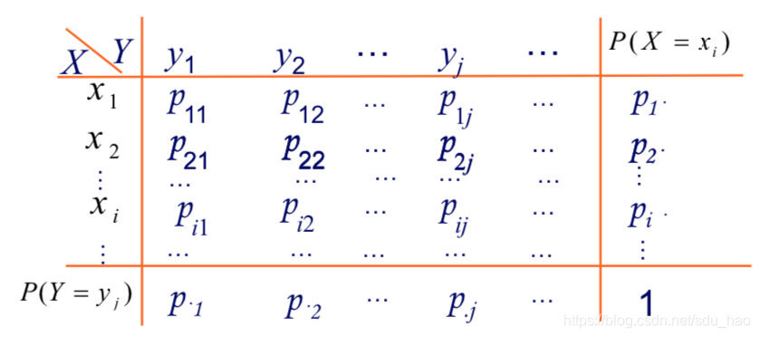

<!--more-->

## 联合分布律

**✒定义**

若二元随机变量 $(X, Y)$ 全部可能取到的不同值是有限对或可列无限对，则称 $(X, Y)$ 是**二元离散型随机变量**。若 $(X, Y)$ 所有可能的取值为 $(x_i, y_j)$，则 $P(X=x_i, Y=y_j)=p_{ij}, i,j=1,2…$ **称为二元离散型随机变量** $(X,Y)$ 的联合概率分布律，简称为 $(X,Y)$ 的分布律。

我们可以用如下表格来表示：

联合分布律的性质：
1. $p_{ij}>0$
2. $\sum_i\sum_j p_{ij}=1$

> [!TIP]
> 例题：一个盒子中有 10 件产品，6件正品，4 件次品。从中取 1 件产品检验，不放回，再取一件。引入如下随机变量： 
> 
> $$
X=
\begin{cases}
0 & 第 1 次取到次品\\
1 & 第 1 次取到正品
\end{cases}
$$
$$
Y=
\begin{cases}
0 & 第 2 次取到次品\\
1 & 第 2 次取到正品
\end{cases}
$$
> 
> 求 $(X,Y)$ 的联合分布律

> [!NOTE]
> 解：$(X,Y)$ 的所有可能取值数有：$(0,0)$，$(0,1)$，$(1,0)$，$(1,1)$
>
> 由乘法公式 $P(AB)=P(A)P(B\vert A)$ 得：
>
> $$P(X=0, Y=0)=P(X=0)P(Y=0\vert X=0)=\frac{4}{10}\times\frac{3}{9}=\frac{2}{15}$$
>
$$P(X=0, Y=1)=\frac{4}{10}\times \frac{6}{9}=\frac{2}{15}$$
> 
> $$P(X=1, Y=0)=\frac{6}{10}\times \frac{4}{9}=\frac{4}{15}$$
>
$$P(X=0, Y=1)=\frac{6}{10}\times \frac{5}{9}=\frac{5}{15}$$

## 边际分布

$X, Y$ 的边际分布律是：

$$
P(X=x_i)=P(X=x_i, \bigcup_{j=1}^\infty (Y=y_j))=\sum_{j=1}^{\infty}p_{ij}\equiv p_{i\cdot}
$$

$$
P(Y=y_j)=P(\bigcup_{i=1}^\infty(X=x_i),  Y=y_j)=\sum_{i=1}^{\infty}p_{ij}\equiv p_{\cdot j}
$$

从图中可以更清楚的看出，$P(X=x_i)$ 就是行相加，$P(Y=y_j)$ 就是列相加。因为写在表格的边儿上，所以我们称为 **边际分布律** 或 **边缘分布律**。

## 条件分布

对于二元离散随机变量 $X,Y$ 的联合概率分布律为：

$$
P(X=x_i, Y=y_j)=p_{ij}
$$

对于固定的 $y_j$，若 $P(Y=y_j)>0$ 则称：

$$
P(X=x_i | Y=y_j)=\frac{P(X=x_i, Y=y_j)}{P(Y=y_j)}=\frac{P_{ij}}{P_{\cdot j}}
$$

为在 $Y=y_j$ 条件下，随机变量 $X$ 的条件分布律。

## 独立

> 为了便于对照，将二元连续随机变量的独立也写在这里。

**✒定义** 若满足 $F(x,y)=F_X(x)\cdot F_Y(y)$ ，则称 $X,Y$ 独立。

但是这种方法并不好判断。我们常用如下等价条件：

**🔄等价条件**

* 离散型：$X,Y$ 独立 $\Leftrightarrow$ $p_{ij} = p_{i\cdot} \times p_{\cdot j}$
* 连续型：$X,Y$ 独立 $\Leftrightarrow$ $f(x,y)=f_X(x)f_Y(y)$

我们有以下定理成立：

**📚定理一：** $X_1, X_2,\cdots, X_n$ 独立且均服从 $B(1,p)$，则 $X_1+\cdots+X_n\sim B(n,p)$

**📚定理二：** $X\sim B(n,p)$ ，$Y\sim B(n_2,p)$，则 $X+Y\sim B(n_1+n_2, p)$

**📚定理三：** $X\sim\pi(\lambda_1)$，$Y\sim\pi(\lambda_2)$ 两者独立，则 $X+Y\sim \pi(\lambda_1+\lambda_2)$

（待证明）

## min/max

$X,Y$ 相互独立，则：

$$
P(\max(X,Y)\leq z)=P(X\leq z, Y\leq z)=P(X\leq z)P(Y\leq z)
$$

$$
P(\min(X,Y)\leq z)=1-P(min(X,Y)\geq z)=1-P(X\geq z)P(Y\geq z)
$$

做题技巧：<b>min 要用 $>,\geq$； max 要用 $<,\leq$</b>