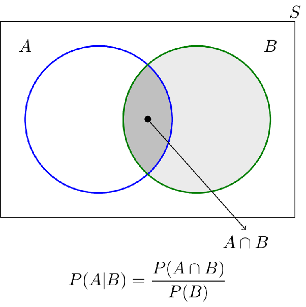

<!--more-->
概率论的研究对象：随机现象的统计规律性

## 随机事件与样本空间

***随机现象***：
: 在一定条件下具有多种可能结果，且实验时无法预知出现哪个结果的现象

***随机实验 E***：
: （1）相同条件下可重复
: （2）结果具有多样性
: （3）实验前结果不确定

***样本空间 Ω***：
: 随机试验所有可能基本结果[^5]的集合称为样本空间，记为 $\Omega =\{结果1,结果2,\cdots\}$
: 根据元素数量，分为有限样本空间和无限样本空间
: 比如，抛硬币的样本空间 $\Omega = \{ \text{正面}, \text{反面} \}$

[^5]: 基本结果：不可再分的结果。比如扔骰子的基本结果为：$1,2,3,4,5,6$，而 $A=\{2,4,6\}$ 并不是基本结果

***样本点***：
: 样本空间的基本元素称为样本点，记为 $\omega$

***随机事件***：
: 随机试验的结果称为随机事件，随机事件是样本空间的子集
: 特殊的随机事件：**必然事件 $\Omega$** 和 **不可能事件 $\varnothing$**
: 不可分解的事件称为 **简单事件** 或 **基本事件**
: 可分解的事件称为 **复合事件**

---

事件的关系和运算（集合的关系与运算）

***事件的包含***：
: 如果事件 A 发生必导致事件 B 发生，则称事件 B 包含事件 A，记为 $A \subset B$
: 显然，$A \subset \Omega$

***事件的相等***：
: 若 $A \subset B$ 且 $B \subset A$，则称事件 A 等于事件 B，记作 $A = B$

***事件的互斥***：
: 如果事件 A 与事件 B 不能在同一次试验中都发生（但可以都不发生），则称事件 A 与事件 B 是互斥或互不相容的

***事件的对立（补）***：
: 事件 A 与事件 B 不可能同时发生，但必发生一个
: 即 $AB = \varnothing, A+B=\Omega$
: 记作 $B = \bar{A}$ 则 $A = \bar{B}$

***事件的和***：
: 事件 A 和事件 B 中至少有一个发生，称为 A、B 的和事件，记为 $A \cup B$
: 当 A、B 互斥时，$A \cup B$ 可记为 $A+B$
: 如果事件$A_1, A_2, \cdots, A_n$ 两两互斥，且 $\Omega = A_1 + A_2 + \cdots A_n$，则称这 n 个事件构成 **互斥完备群**
: 可列[^1]多个事件的和事件，即事件$A_1, A_2, \cdots, A_n$至少发生一个，记为 $\bigcup_{i=1}^n A_i$

[^1]: 可列：可以与自然数一一对应

***事件的积***：
: 事件 A 与事件 B 同时发生，记为 $A \cap B$ 简记为 $AB$
: 可列[^1]多个事件的积事件，即事件$A_1, A_2, \cdots, A_n$全部发生，记为 $\prod_{i=1}^\infty A_i$

***事件的差***：
: 事件 A 发生且事件 B 不发生，记为 $A-B$

> [!TIP]
> 样本空间S中的随机事件为$A$，则下列错误的是： A. $A\cup A=A$ B. $AA=A$ C. $A-A=0$ D. $S-A=\bar{A}$

> [!NOTE]
> 答案：C. 因为0并不能表示事件，正确为$A-A=\varnothing$

---

**事件的运算法则**

1. 交换律：$A \cup B = B \cup A$，$AB = BA$
2. 结合律：$(A \cup B) \cup C = A \cup (B \cup C)$，$(AB)C = A(BC)$
3. 分配律：$A(B \cup C) = AB \cup AC$，$A \cup (B \cap C) = (A \cup B) \cap (A \cup C)$
4. 对偶率：$\overline{A \cup B} = \bar{A} \cap \bar{B}$，$\overline{A \cap B} = \bar{A} \cup \bar{B}$

## 频率与概率

***频率***：
: 设事件 A 在 $n$ 次试验中出现了 $r$ 次，则比值 $r/n$ 称为事件 A 出现的频率

***概率***：
: **统计定义**：在同一组条件下所作的大量重复试验中，事件Ａ 出现的频率总是在区间$[0，1]$上的一个确定的常数ｐ附近摆动，并且稳定于ｐ，则 ｐ 称为事件Ａ 的概率，记作 $P(A)$。
:  
: **古典定义**：如果基本事件（样本点）的总数为ｎ，事件Ａ 所包含的基本事件（样本点）个数为$m (m \leq n)$，则定义事件Ａ的概率 $P(A)$ 为 $r/n$。
:  
: **几何定义**：设 $\Omega$ 是某一有界区域（一维，二维或三维等），向 $\Omega$ 中随机投掷一点 $M$，如果 $M$ 落在 $\Omega$ 中任一点是等可能的（或说是均匀分布的），则说这个试验是几何概型。其中，事件 A=“点 M 落在区域 $A \subset \Omega$” 的概率定义为 $P(A) = \frac{A \text{的测度}}{\Omega \text{的测度}}$ [^2]

[^2]: 测度：指长度、面积、体积等

**🚩注意** 频率来源于实践，概率来源于理论。

### 古典概型

***古典概型***：
: 满足以下两个条件的随机试验称为古典概型：
: （1） 有限性。只有有限多个不同的基本事件。
: （2） 等可能性。每个基本事件出现的可能性相等。

> [!TIP]
> 例题：抽球模型。设有 a 个黄球，b 个白球，不放回地抽取 k 次，问第 k 次抽取黄球的概率

> [!NOTE]
> 解：第 k 次取出的球是黄球意味着：第 k 次是从 a 个黄球中取出一球，再在 a+b-1 个球中取出 k-1 个球。
> 
> 设 B = {第 k 次取出的球是黄球}
> 样本空间的总点数 $n = A_{a+b}^k$
> 事件 B 包含的样本点数 $r=C_a^1 A_{a+b-1}^{k-1}$
> $P(B) = \frac{r}{n} = \frac{a A_{a+b-1}^{k-1}}{A_{a+b}^k} = \frac{a}{a+b}$

> [!TIP]
> 例题：n 个质点在 N 个格子中的分布问题。设有 n 个不同质点，每个质点都以概率 1/N 落入 N 个格子（N $\geq$ n），问： 
> 1. A：指定 n 个格子中各有一个质点：$P_A = \frac{n!}{N^n}$ 
> 2. B：任意 n 个格子中各有一个质点：$C_N^n \cdot n!$ 
> 3. C：指定的一个格子中恰有 m（m $\leq$ n）个质点：$C_n^m (N-1)^{n-m}$ 

为了防止忘记高中的内容，总结了下表（样本空间 $n$，抽取 $k$ 个样本）：

|抽样类型|总结果数|
|----|----|
|有放回有序|$n^k$|
|有放回无序[^4]|$C_{n+k-1}^{k}$|
|无放回有序|$A_n^k=n!/(n-k)!$|
|无放回无序|$C_n^k=\frac{n!}{k!(n-k)!}$|

[^4]: [知乎专栏：有放回无序抽样问题](https://zhuanlan.zhihu.com/p/48248142)

### 几何概型

***几何概型***
: 如果每个事件发生的概率只与构成该事件区域的长度(面积或体积或度数)成比例，则称这样的概率模型为几何概率模型，简称为几何概型。

> [!TIP]
> 设 A、B 是两个随机事件，若 P(AB) = 0，则下面命题中正确的是：
> A. A 和 B 互不相容（互斥）
> B. AB 是不可能事件
> C. AB 不一定是不可能事件
> D. P(A)=0 或 P(B)=0

> [!NOTE]
> 解：对于只有一个点的事件，由于不为空，所以不是不可能事件，但其测度为 0，所以概率为 0。故答案选 C

> [!CAUTION]
> 考试时不能写近似值，必须写精确值

> Buffon 投针等更多例题可参见 [几何概型的解法归纳](https://wenku.baidu.com/view/9947c559f121dd36a22d824c.html)

## 概率的公理化定义

***事件域***
: 满足如下条件的集合：

1. $\Omega \subset F$
2. $\text{若} A \in F, \text{则} \bar{A} \in F$
3. $\text{若} A_n \in F, \text{则} \bigcup_{n=1}^\infty F$

***概率***
: 设 $\Omega$ 是样本空间，$A \in F$，$P(A)$ 是 $A$ 的实值函数[^3]，且满足：
: （1） 非负性：对任一事件 A 有：$0 \leq P(A) \leq 1$（实际上，只需要 $0 \leq P(A)$ 即可）
: （2） 规范性：$P(\Omega)=1$
: （3） 可列可加性：对可列[^1]个两两互斥的事件$A_1, A_2, \cdots$，有$P(\bigcup_{i=1}^\infty A_i) = \sum_{i=1}^\infty P(A_i)$。或者换种表述：对于无限个两两互斥的事件 $A_1,A_2,\cdots$，其和的概率等于概率之和，$P(A_1+A_2+\cdots)=P(A_1)+P(A_2)+\cdots$
: 称 $P(A)$ 是 A 的概率。P 称为事件域 F 上的概率测度。

[^3]: 实值函数：函数值为实数

## 概率的性质

**🌟性质①：** $P(\varnothing) = 0$

**🔍证明：** 对任一事件 A，$A = A+\varnothing$ ，则

$$
P(A)=P(A+\varnothing)=P(A)+P(\varnothing)
$$

证得：$P(\varnothing)=0$

---

**🌟性质②：**（有限可加性）若 $A_1, A_2, \cdots$ 两两不相容，则 $P(A_1 \cup A_2 \cup \cdots \cup A_n) = P(A_1) + P(A_2) + \cdots + P(A_n)$

**🔍证明：** 

令$A_{n+1}=A_{n+2}=\cdots=\varnothing$，由可列可加性：

$$
P(A_1 \cup A_2 \cup \cdots \cup A_n)\\
= P(\bigcup_{i=1}^\infty A_i) = \sum_{i=1}^\infty P(A_i)\\
 = \sum_{i=1}^n P(A_i) + 0\\
 = P(A_1) + P(A_2) + \cdots + P(A_n)
$$

---

**🌟性质③：** 设 A，B 是两个事件，若 $A \subset B$，则有：

$$
\begin{align}
P(B-A)&=P(B)-P(A)\\
P(B)&\geq P(A)
\end{align}
$$

**🔍证明：** 

由 $A \subset B$ 知 $B = A \cup (B-A)$，且 $A(B-A)=\varnothing$，由有限可加性，知：$P(B)=P(A)+P(B-A)$；又由概率非负性，$P(B-A) \geq 0$，知：$P(B)\geq P(A)$

由这一条，我们可以推出 $P(A)\leq P(\Omega)=1$

---

**🌟性质④：** （概率的**减法公式**）对于任意事件 A、B，有 $P(A-B)=P(A\bar{B}) = P(A) - P(AB)$

**🔍证明：**

$A=(A-B)+AB$，且 $(A-B)$ 与 $AB$ 互斥，故由有限可加性，$P(A)=P(A-B)+P(AB)$，从而 $P(A-B)=P(A)-P(AB)$

$A=A\Omega=A(B+\bar{B})=AB+A\bar{B}$，且 $AB\subset B$ 与 $A\bar{B}\subset \bar{B}$ 互斥，故由有限可加性，$P(A)=P(AB)+P(A\bar{B})$，从而 $P(A\bar{B})=P(A)-P(AB)$

---

**🌟性质⑤：** （概率的**加法公式**）对于任意事件 A、B、C，有：

$$
\begin{align}
&P(A \cup B) = P(A) + P(B) - P(AB)\\
&P(A \cup B \cup C) = P(A) + P(B) + P(C) - P(AB) - P(AC) - P(BC) + P(ABC)
\end{align}
$$

**🔍证明：**

$$
\begin{align}
\because A\cup B &= A\cup(B-A)\\
\therefore P(A\cup B)&=P(A)+P(B-A)\\
&=P(A)+P(B)-P(AB)
\end{align}
$$

## 条件概率

***条件概率（Conditional probability）***
: 对事件 A、B，若 P(B)>0，则称 $P(A\vert B)=\frac{P(AB)}{P(B)}$ 为事件 A 在事件 B 发生下的条件概率

请思考 $P(A\vert B)$ 与 $P(A)$ 的大小关系？

**✨条件概论的性质：**

1. 非负性 $P(B\vert A) \geq 0$
2. 规范性 若 $B \subset A$，则 $P(A \vert B)=1$
3. 可列可加性
   若 $B_1, B_2, \cdots$ 为一列两两互不相容事件，
   则 $P(\sum_{k=1}^\infty B_k | A) = \sum_{k=1}^\infty P(B_k | A)$
   常用：$P(\bar{B} | A) = 1 - P(B|A)$

---

**📚定理：** 由条件概率的定义可知，若 $P(A)>0$，则 $P(AB) = P(A)P(B|A)$. 这称为**乘法公式**。可推广到多个事件，例如，设 $P(AB)>0$，则有

$$
P(ABC)=P(C|AB)P(B|A)P(A)
$$